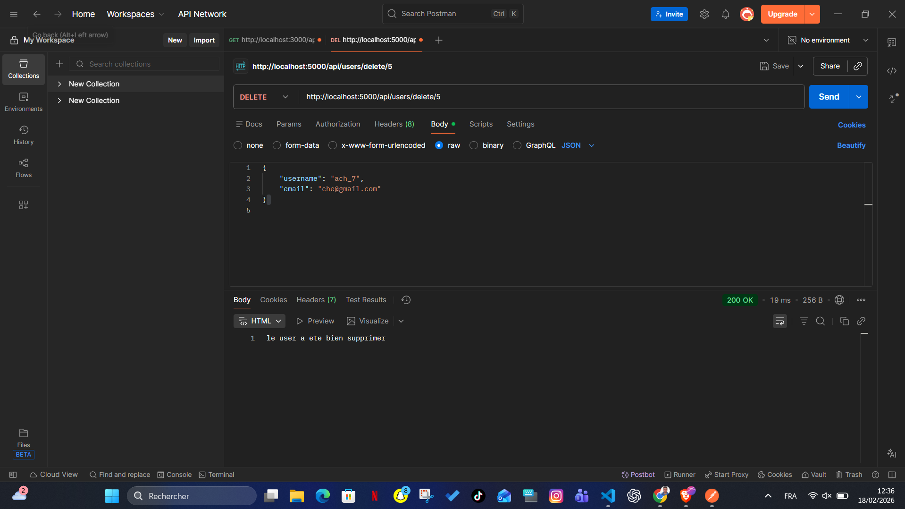
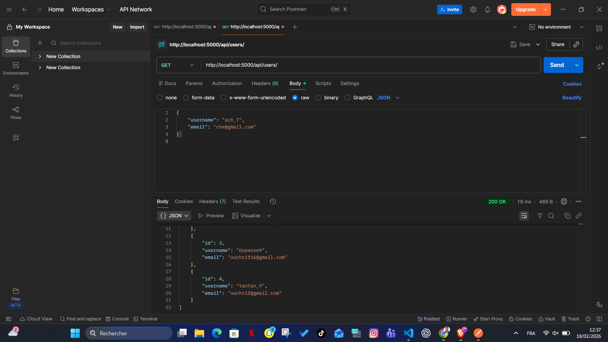

# express-backend-workshop

Petit projet backend avec Express.js pour apprendre la creation d'une API REST simple.

## Objectif
Ce workshop montre les bases suivantes:
- demarrer un serveur Express
- utiliser un middleware (`express.json()`)
- creer des routes REST
- manipuler une liste d'utilisateurs en memoire

## Stack
- Node.js
- Express.js
- Nodemon (mode developpement)

## Installation
```bash
npm install
```

## Lancer le projet
Mode normal:
```bash
npm start
```

Mode developpement (redemarrage auto):
```bash
npm run dev
```

Le serveur demarre sur:
`http://localhost:5000`

## Structure simple
- `server.js`: point d'entree de l'API
- `package.json`: scripts et dependances
- `images/`: captures des tests Postman

## Routes API
Base URL:
`http://localhost:5000`

### 1) Recuperer tous les users
- Methode: `GET`
- URL: `/api/users`
- Reponse: tableau JSON des utilisateurs

Exemple de reponse:
```json
[
  {
    "id": 1,
    "username": "saidou_7",
    "email": "saidouchrif16@gmail.com"
  }
]
```

### 2) Ajouter un user
- Methode: `POST`
- URL: `/api/users`
- Body JSON attendu:
```json
{
  "username": "ach_7",
  "email": "che@gmail.com"
}
```
- Reponse actuelle: `le user a ete bien ajouter`

### 3) Supprimer un user
- Methode: `DELETE`
- URL: `/api/users/delete/:id`
- Exemple: `/api/users/delete/5`
- Reponse actuelle: `le user a ete bien supprimer`

Note importante:
Dans la version actuelle de `server.js`, la suppression utilise `users.splice(id, 1)`. Cela signifie que `:id` est utilise comme index du tableau, pas comme identifiant metier strict.

## Test rapide avec Postman
1. Envoyer `GET /api/users` pour voir la liste.
2. Envoyer `POST /api/users` avec un body JSON pour ajouter un utilisateur.
3. Refaire `GET /api/users` pour verifier l'ajout.
4. Envoyer `DELETE /api/users/delete/:id`.
5. Refaire `GET /api/users` pour verifier la suppression.

## Captures des routes (Postman)

### POST - Ajouter un user


### POST - Reponse de confirmation


### GET - Recuperation de la liste des users


### DELETE - Suppression d'un user


### GET - Liste apres suppression

